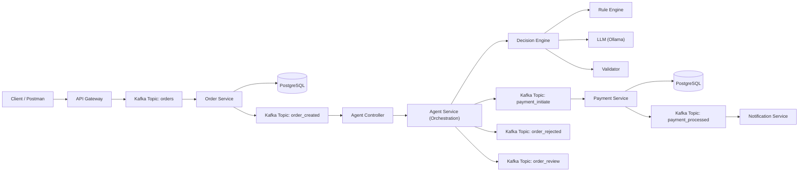

# 🛒 E-commerce Microservices with Kafka, NestJS & AI Agent

## 🚀 Overview

This project demonstrates a **production-style event-driven microservices architecture** using Kafka and NestJS, enhanced with a **hybrid AI-powered decision engine**.

The system simulates an e-commerce workflow where services communicate asynchronously via Kafka, and an AI agent **safely controls the flow of events using rules + LLM reasoning**.

---

## 🧱 Architecture



---

## ⚙️ Tech Stack

* **Backend Framework**: NestJS
* **Message Broker**: Apache Kafka (KafkaJS)
* **Database**: PostgreSQL
* **AI Runtime**: Ollama (LLaMA 3)
* **Containerization**: Docker & Docker Compose
* **ORM**: TypeORM

---

## 📦 Microservices

### 1️⃣ API Gateway

* Handles HTTP requests
* Publishes events to Kafka (`orders` topic)

---

### 2️⃣ Order Service

* Consumes `orders`
* Persists order in PostgreSQL
* Emits `order_created`

---

### 3️⃣ AI Agent Service 🧠 (Core Highlight)

* Consumes `order_created`
* Uses **Agent Service (orchestration layer)**
* Executes hybrid decision pipeline
* Emits:

  * `payment_initiate`
  * `order_rejected`
  * `order_review`

---

### 4️⃣ Payment Service

* Consumes `payment_initiate`
* Processes payment (simulated)
* Stores result in DB
* Emits `payment_processed`

---

### 5️⃣ Notification Service

* Consumes:

  * `payment_processed`
  * `order_rejected`
  * `order_review`
* Sends notification (simulated)

---

## 🤖 AI Agent (Core Highlight)

### 🧠 Purpose

Instead of blindly processing orders, the AI agent **controls system flow dynamically while maintaining strict safety guarantees**.

---

## 🧠 Hybrid Decision Engine

The system follows a **production-grade hybrid pattern**:

---

### 1️⃣ Rule-Based Guardrails (Authoritative)

* Invalid user → **REJECT**
* High price (> 50,000) → **REVIEW**
* Otherwise → **APPROVE**

👉 These rules are **final authority**

---

### 2️⃣ LLM-Based Evaluation (Advisory)

* Uses local LLM via Ollama
* Invoked **only when rule decision = APPROVE**
* Helps identify ambiguous or risky cases

---

### 3️⃣ Validation Layer (Critical Safety)

Ensures:

* LLM **cannot override strict rules**
* LLM can only **increase risk level**

#### Example:

| Rule    | LLM     | Final  |
| ------- | ------- | ------ |
| APPROVE | REVIEW  | REVIEW |
| APPROVE | REJECT  | REJECT |
| REJECT  | APPROVE | REJECT |

---

### 4️⃣ Fallback Strategy

* Invalid / malformed LLM response → `REVIEW`
* Ensures **system stability**

---

## 🔍 Observability (Structured Logging)

Structured logs provide full traceability of decision flow.

---

### 📌 Decision Trace

```json
{
  "event": "ORDER_PROCESSED",
  "orderId": 42,
  "userId": "blocked-user",
  "price": 40000,
  "ruleDecision": "REJECT",
  "llmDecision": null,
  "finalDecision": "REJECT"
}
```

---

### 📌 LLM Response

```json
{
  "event": "LLM_RESPONSE",
  "orderId": 41,
  "raw": "{\"decision\": \"APPROVE\"}"
}
```

---

### 📌 Processing Time

```json
{
  "event": "PROCESSING_TIME",
  "orderId": 42,
  "durationMs": 1
}
```

---

### 📌 Override Protection

```json
{
  "event": "LLM_OVERRIDE_BLOCKED",
  "orderId": 50,
  "ruleDecision": "REJECT",
  "llmDecision": "APPROVE"
}
```

---

## 🔄 Event Flow

```
POST /orders
   ↓
Kafka (orders)
   ↓
Order Service → DB
   ↓
Kafka (order_created)
   ↓
Agent Controller
   ↓
Agent Service
   ↓
Decision Engine (Rule → LLM → Validator)
   ↓
Kafka (payment_initiate / order_rejected / order_review)
   ↓
Payment / Notification Services
```

---

## 🐳 Setup Instructions

### 1. Start Infrastructure

```bash
docker compose up -d
```

Includes:

* Kafka
* Zookeeper
* PostgreSQL
* pgAdmin

---

### 2. Install Ollama

```bash
curl -fsSL https://ollama.com/install.sh | sh
```

Run model:

```bash
ollama run llama3
```

---

### 3. Run Services

```bash
cd api-gateway && npm install && npm run start:dev
cd order-service && npm install && npm run start:dev
cd agent-service && npm install && npm run start:dev
cd payment-service && npm install && npm run start:dev
cd notification-service && npm install && npm run start:dev
```

---

### 4. Test API

```bash
POST http://localhost:3000/orders
Content-Type: application/json

{
  "userId": "user1",
  "product": "phone",
  "price": 200
}
```

---

## 🎯 Current Scope

* Event-driven microservices
* Hybrid AI decision engine
* Safe LLM integration
* Structured observability

---

## 🔮 Future Improvements

* Persist decisions & approved payments
* Add monitoring dashboards (Grafana / Prometheus)
* Retry & circuit breaker for LLM
* Evaluation datasets for model tuning

---

## 🏁 Conclusion

This project demonstrates how to integrate LLMs into backend systems **safely and realistically** by combining:

* Deterministic rules
* AI-assisted reasoning
* Validation safeguards
* Observability

---

## 📌 Note

Project intentionally stops at the decision stage. Payment persistence and downstream guarantees are planned as future enhancements.
