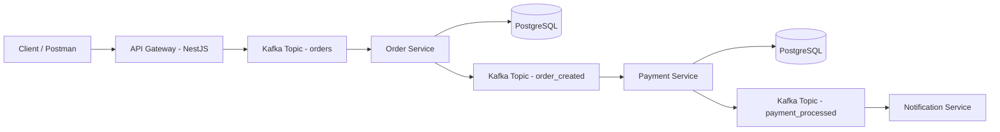

# 🛒 E-commerce Microservices with Kafka & NestJS

## 🚀 Overview

This project demonstrates an **event-driven microservices architecture** using Kafka and NestJS.

It simulates an e-commerce workflow with multiple services communicating asynchronously via Kafka.

---

## 🧱 Architecture



---

## ⚙️ Tech Stack

- **Backend Framework**: NestJS
- **Message Broker**: Apache Kafka (KafkaJS)
- **Database**: PostgreSQL
- **Containerization**: Docker & Docker Compose
- **ORM**: TypeORM

---

## 📦 Services

### 1️⃣ API Gateway

- Accepts HTTP requests
- Publishes events to Kafka (`orders` topic)

---

### 2️⃣ Order Service

- Consumes `orders` events
- Stores order in PostgreSQL
- Emits `order_created` event

---

### 3️⃣ Payment Service

- Consumes `order_created`
- Processes payment (simulated)
- Stores payment status
- Emits `payment_processed`

---

### 4️⃣ Notification Service

- Consumes `payment_processed`
- Sends notification (simulated)

---

## 🔄 Event Flow

```
POST /orders
   ↓
Kafka (orders)
   ↓
Order Service → DB
   ↓
Kafka (order_created)
   ↓
Payment Service → DB
   ↓
Kafka (payment_processed)
   ↓
Notification Service
```

---

## 🐳 Setup Instructions

### 1. Start Infrastructure

```bash
docker compose up -d
```

Services started:

- Kafka
- Zookeeper
- PostgreSQL
- pgAdmin

---

### 2. Run Services

```bash
cd api-gateway && npm install && npm run start:dev
cd order-service && npm install && npm run start:dev
cd payment-service && npm install && npm run start:dev
cd notification-service && npm install && npm run start:dev
```

---

### 3. Test API

```bash
POST http://localhost:3000/orders
Content-Type: application/json

{
  "userId": "user1",
  "product": "phone"
}
```

---

## 🗄️ Database Access (pgAdmin)

- URL: http://localhost:5050
- Email: `admin@admin.com`
- Password: `admin`

Connection config:

- Host: `postgres`
- Port: `5432`

---

## 🎯 Key Features

- Event-driven architecture using Kafka
- Microservices communication via async events
- Chained service workflow (Order → Payment → Notification)
- PostgreSQL persistence
- Dockerized infrastructure
- Scalable and loosely coupled design

---

## 🚀 Future Enhancements

- Retry mechanism & Dead Letter Queue (DLQ)
- Redis integration (caching / state)
- AI Agent for intelligent decision-making
- Observability (logging, tracing)
- API rate limiting

---

## 💡 Learning Outcomes

- Kafka fundamentals (topics, partitions, consumer groups)
- Event-driven system design
- Microservices architecture with NestJS
- Async communication patterns
- Database integration with TypeORM

---

## 📌 Author

Shivam Kumar
