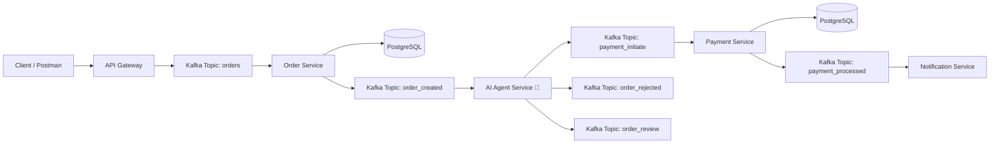

# 🛒 E-commerce Microservices with Kafka, NestJS & AI Agent

## 🚀 Overview

This project demonstrates a **production-style event-driven microservices architecture** using Kafka and NestJS, enhanced with an **AI-powered decision engine**.

The system simulates an e-commerce workflow where services communicate asynchronously via Kafka, and an AI agent intelligently controls the flow of events.

---

## 🧱 Architecture



---

## ⚙️ Tech Stack

- **Backend Framework**: NestJS
- **Message Broker**: Apache Kafka (KafkaJS)
- **Database**: PostgreSQL
- **AI Runtime**: Ollama (local LLM)
- **Containerization**: Docker & Docker Compose
- **ORM**: TypeORM

---

## 📦 Microservices

### 1️⃣ API Gateway

- Handles HTTP requests
- Publishes events to Kafka (`orders` topic)

---

### 2️⃣ Order Service

- Consumes `orders`
- Persists order in PostgreSQL
- Emits `order_created`

---

### 3️⃣ AI Agent Service 🧠

- Consumes `order_created`
- Evaluates order using **Hybrid AI + Rules**
- Emits:
  - `payment_initiate`
  - `order_rejected`
  - `order_review`

---

### 4️⃣ Payment Service

- Consumes `payment_initiate`
- Processes payment (simulated)
- Stores result in DB
- Emits `payment_processed`

---

### 5️⃣ Notification Service

- Consumes:
  - `payment_processed`
  - `order_rejected`
  - `order_review`
- Sends notification (simulated)

---

## 🤖 AI Agent (Core Highlight)

### 🧠 Purpose

Instead of blindly processing orders, the AI agent **decides the flow dynamically**.

---

### ⚙️ Decision Types

| Decision | Action                     |
| -------- | -------------------------- |
| APPROVE  | Proceed to payment         |
| REJECT   | Stop processing            |
| REVIEW   | Flag for manual inspection |

---

## 🧠 Hybrid Decision Engine

The system uses a **production-style hybrid approach**:

---

### 1️⃣ Rule-Based Guardrails (Fast & Deterministic)

- Low price → APPROVE
- High price → REVIEW
- Blocked user → REJECT

---

### 2️⃣ AI-Based Evaluation (Flexible)

- Uses local LLM via Ollama
- Handles ambiguous cases
- Runs fully offline (no API cost)

---

### 3️⃣ Resilient Output Handling

LLMs are non-deterministic, so:

- AI output is parsed safely
- Keywords extracted (APPROVE / REJECT / REVIEW)
- Invalid responses fallback to safe default

---

### 4️⃣ Fallback Strategy

- AI failure or timeout → `REVIEW`
- Ensures system stability

---

## 🔄 Event Flow

```
POST /orders
   ↓
Kafka (orders)
   ↓
Order Service → DB
   ↓
Kafka (order_created)
   ↓
AI Agent Service 🧠
   ↓
Kafka (payment_initiate / order_rejected / order_review)
   ↓
Payment / Notification Services
```

---

## 🐳 Setup Instructions

### 1. Start Infrastructure

```bash
docker compose up -d
```

Includes:

- Kafka
- Zookeeper
- PostgreSQL
- pgAdmin

---

### 2. Install Ollama (for AI)

```bash
curl -fsSL https://ollama.com/install.sh | sh
```

Run lightweight model:

```bash
ollama run tinyllama
```

---

### 3. Run Services

```bash
cd api-gateway && npm install && npm run start:dev
cd order-service && npm install && npm run start:dev
cd agent-service && npm install && npm run start:dev
cd payment-service && npm install && npm run start:dev
cd notification-service && npm install && npm run start:dev
```

---

### 4. Test API

```bash
POST http://localhost:3000/orders
Content-Type: application/json

{
  "userId": "user1",
  "product": "phone",
  "price": 200
```
