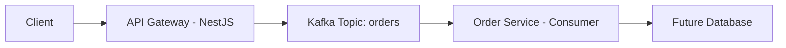

# Kafka + NestJS Microservices (E-commerce Backend)

## 🚀 Overview
Event-driven microservices architecture using Kafka and NestJS.

## 🧱 Architecture

## ⚙️ Tech Stack
- NestJS
- Kafka (KafkaJS)
- Docker
- TypeScript

## 🔄 Flow
POST /orders → Kafka topic → consumer processes order

## 📦 Services
- api-gateway (producer)
- order-service (consumer)

## ▶️ How to Run
1. docker compose up -d
2. run both services
3. hit POST /orders

